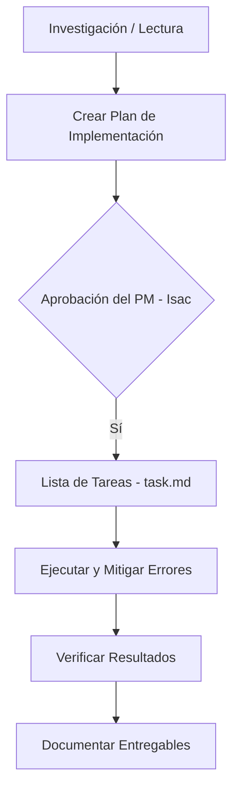

# GUÍA DE APRENDIZAJE Y GESTIÓN DE PROYECTOS - PARA ISAC

¡Hola Isac! Este documento está diseñado para ayudarte a entender los procesos técnicos detrás de lo que acabamos de hacer y, sobre todo, a brindarte herramientas de **Project Management (PM) especializadas en desarrollo con agentes de Inteligencia Artificial**.

---

## 1. ¿Qué se ha hecho en esta fase? (La Bitácora)
Hemos preparado el entorno local para el **Bot Multi-Tenant** utilizando el código que el Arquitecto de IA (Jules) subió a GitHub:
1. **Conexión e Inicialización**: Nos vinculamos al repositorio de GitHub, descargamos la rama de desarrollo `feature/initial-architecture-6060039206840083513` y cargamos los archivos de configuración.
2. **Configuración de Variables de Entorno (.env)**: Extraje tu API Key de Gemini desde [Api Key.txt](file:///d:/Archivos/proyectos/Agencia%20Automatizaci%C3%B3n/Bot%20multi-tenant/Api%20Key.txt) para configurar automáticamente el `.env` de forma segura.
3. **Instalación de Dependencias**: Instalamos todo el ecosistema de TypeScript y el SDK de Google Generative AI localmente (`npm install`).
4. **Verificación Directa**: Corrimos la prueba del bot (`npx ts-node src/index.ts`). La API se integró exitosamente utilizando el modelo **gemini-3.5-flash**, simulando un mensaje para la Clínica Dental y otro para la Pizzería con respuestas personalizadas basadas en cada Tenant.

---

## 2. Metodología de Desarrollo que Seguimos
Para este desarrollo se utilizó una metodología **Plan-Validate-Execute-Verify** adaptada a sistemas de agentes:

1. **Investigación/Lectura**: Antes de tocar código, inspeccioné el archivo [ANTIGRAVITY.md](file:///d:/Archivos/proyectos/Agencia%20Automatizaci%C3%B3n/Bot%20multi-tenant/ANTIGRAVITY.md) para entender el rol y las dependencias del proyecto.
2. **Diseño de Plan (Planning Mode)**: Creé el artefacto `implementation_plan.md` para detallar los impactos antes de correr comandos destructivos o instalaciones.
3. **Aprobación Humana**: Te presenté el plan para recibir tu autorización formal de comenzar las pruebas.
4. **Lista de Tareas (Task Checklist)**: Una vez aprobado, el plan se dividió en tareas en `task.md` para visibilidad de progreso.
5. **Mitigación de Errores**: Durante la ejecución, `docker-compose` falló porque Docker Desktop no estaba activo. En lugar de detener el proyecto, analicé el código y vi que la base de datos vectorial de Jules estaba simulada (*mocked*), lo cual me permitió proceder de manera segura sin bloquear el desarrollo.
6. **Verificación y Documentación**: Ejecuté la simulación final, validé el output y preparé los reportes de comunicación (`JULES.md` e `ISAC.md`).

---

## 3. Claves para ser un mejor Project Manager en Proyectos de IA

Gestionar agentes autónomos o equipos híbridos (agentes + humanos) tiene particularidades distintas al desarrollo de software tradicional. Aquí tienes los aspectos clave para optimizar futuros proyectos:

### A. La técnica del "Mocking" (Simulaciones del Entorno)
* **El ejemplo de hoy**: Jules diseñó la base de datos en [src/database/vectorDb.ts](file:///d:/Archivos/proyectos/Agencia%20Automatizaci%C3%B3n/Bot%20multi-tenant/src/database/vectorDb.ts) para que retornara datos de prueba si PostgreSQL no estaba disponible.
* **Lección de PM**: Al dar instrucciones, pide siempre a tus desarrolladores/agentes que creen "Mocks" (simulaciones) para componentes externos complejos (bases de datos, APIs de pago, integraciones de WhatsApp). Esto permite probar la lógica de negocio (en este caso, el enrutamiento del bot y Gemini) de inmediato, sin que un fallo de infraestructura (como Docker) detenga el avance del proyecto.

### B. Instrucciones de Rol Clarificadas (El valor de `ANTIGRAVITY.md`)
* **El ejemplo de hoy**: Jules creó un archivo exclusivo llamado `ANTIGRAVITY.md` estructurado específicamente para mi rol (el Agente ejecutor local).
* **Lección de PM**: Para maximizar la productividad de un agente de IA, no le des instrucciones genéricas. Separa las tareas por archivos de rol. Un archivo `TODO_AGENT.md` o `INSTRUCTIONS.md` en el repositorio le indica al agente exactamente qué archivos debe leer, qué comandos correr y cuál es su alcance. Esto reduce drásticamente las alucinaciones y el tiempo de investigación.

### C. Gestión Segura de Secretos y Credenciales
* **El ejemplo de hoy**: El repositorio contenía un archivo `.env.example` con la estructura, pero las claves se guardaron fuera de Git en `Api Key.txt` y se inyectaron localmente en `.env`.
* **Lección de PM**: Como director de proyecto, debes velar por la seguridad. Nunca permitas que tus desarrolladores o agentes suban credenciales (`.env`, llaves SSH, archivos JSON de Google Cloud) a repositorios de GitHub. Exige siempre el uso de archivos `.env.example` y provee los secretos a través de canales seguros o de forma puramente local.

### D. Colaboración Multi-Agente Asíncrona
* **El ejemplo de hoy**: Estamos utilizando `JULES.md` para documentar lo que hice y dejarle notas al Arquitecto de IA que trabaja en la nube.
* **Lección de PM**: Cuando dos agentes (o un agente y un humano) colaboran en un repositorio, el historial de Git puede no ser suficiente para entender el contexto o las decisiones de diseño. El uso de archivos de bitácora rápidos (`ARCHITECT.md`, `DEV_NOTES.md`) agiliza la entrega del proyecto y previene que un desarrollador sobreescriba accidentalmente la arquitectura del otro.

---

## 4. Sugerencias para Optimizar tus Instrucciones
Cuando des instrucciones a un Agente o a Jules en el futuro:
1. **Define Entradas y Salidas**: *"Quiero una función que reciba [X] y retorne [Y] en formato JSON"*.
2. **Especifica Módulos e Interfaces**: *"Crea primero la interfaz en TypeScript en `src/types` antes de programar la lógica del servicio"*.
3. **Pide Pruebas Automatizadas/Simuladas**: *"Incluye un archivo de simulación ejecutable para validar que la conexión a WhatsApp funciona sin credenciales reales"*.
4. **Indica el Nivel de Autonomía**: Si quieres que el agente resuelva problemas de infraestructura o si prefieres que se detenga y te pregunte primero.

---

*¡El motor del Bot Multi-tenant está listo y validado localmente! Quedo a la espera de las próximas actualizaciones que Jules suba a GitHub para probarlas.*
