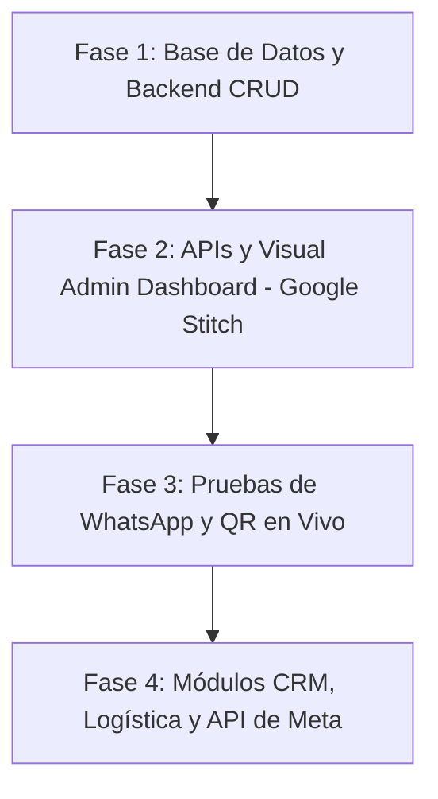

# GUÍA DE APRENDIZAJE Y GESTIÓN DE PROYECTOS - PARA ISAC

¡Hola Isac! Has hecho preguntas clave que separan a un programador de un **Director de Proyectos / Product Owner** exitoso. A continuación, te explico conceptualmente cómo funciona el modelo de negocio SaaS (Software as a Service), el sistema de métricas por cliente y cómo llevaremos este proyecto a internet.

---

## 1. ¿Cómo se ofrece este servicio y cómo se implementa para cada cliente?

Este proyecto utiliza una arquitectura **Multi-Tenant (Multi-Inquilino)**. 

### El Modelo Tradicional (Costoso e Ineficiente)
Crear un servidor y una base de datos independientes para cada cliente (ej. un servidor para el dentista, otro para la pizzería). Esto multiplica tus costos de hosting y hace que actualizar el código sea una pesadilla.

### El Modelo SaaS Multi-Tenant (Eficiente y Escalable) 🚀
Corremos **un único servidor central** en la nube con **una única base de datos**.
* **El Registro de Clientes**: En la base de datos registramos a cada cliente con un `client_id` único (ej. `client_001` para el Dentista y `client_002` para la Pizzería).
* **Conexión de WhatsApp**: Cada cliente vincula su número de WhatsApp escaneando un código QR único que genera nuestro servidor.
* **El Enrutador (Router)**: Cuando entra un mensaje a cualquiera de las líneas conectadas, nuestro código identifica el número al que escribieron, busca en la base de datos a quién pertenece ese número (ej. `1234567890` -> Dentista), carga sus documentos de Drive (RAG), su prompt personalizado y sus herramientas activas, y procesa la respuesta en milisegundos.

De esta forma, puedes tener **100 o 1,000 clientes corriendo sobre el mismo servidor de $10 USD al mes**, maximizando tu margen de ganancia.

---

## 2. El Panel de Métricas: Control de Consumo e Interacciones

Para ofrecer un servicio SaaS, es vital medir el consumo. Esto te permite:
1. Mostrarle al cliente el valor que le estás aportando (ej. *"Tu bot atendió 500 chats este mes"*).
2. Cobrar de forma justa (ej. planes por cantidad de mensajes o cobro por uso de API de Gemini).
3. Monitorear tus propios costos de OpenAI/Google Gemini.

### ¿Cómo se implementa a nivel técnico?
Propropuse a Jules en [JULES.md](file:///d:/Archivos/proyectos/Agencia%20Automatizaci%C3%B3n/Bot%20multi-tenant/JULES.md) agregar una tabla llamada `interactions`. Cada vez que el bot recibe y responde un mensaje, el servidor guardará un registro:
- ¿Quién mandó el mensaje? (`sender_phone`)
- ¿A qué cliente pertenece? (`client_id`)
- ¿Cuántos tokens (palabras) consumió Gemini?
- El costo exacto del mensaje en dólares.

### El Dashboard Visual
Con estos registros en la base de datos, Jules podrá construir un **Frontend Web** (un panel de control) donde:
* **Tú (Super Admin)**: Podrás ver el total de mensajes de todas las cuentas, el costo total de la API y las ganancias mensuales.
* **Tus Clientes (Tenants)**: Podrán iniciar sesión con un usuario y contraseña para ver sus propios reportes de mensajes recibidos, citas agendadas o pedidos generados.

---

## 3. ¿Cómo se sube esto online? ¿Subimos el contenedor?

**Sí, subiremos los contenedores de Docker a internet.** Esta es la gran ventaja de haber configurado Docker: lo que funciona localmente funcionará exactamente igual en la nube.

### El proceso de despliegue a producción:
1. **Comprar un Servidor (VPS)**: Contratamos un servidor virtual en servicios como DigitalOcean, AWS o Render (normalmente cuesta de $5 a $15 USD mensuales para iniciar).
2. **Subir el código**: Clonamos tu repositorio de GitHub en ese servidor remoto.
3. **Encender Docker**: Ejecutamos el comando `docker compose up --build -d` en el servidor. Esto levantará tanto la base de datos PostgreSQL (`pgvector`) como la aplicación de Node.js en internet de forma permanente.
4. **Configurar un Webhook**: Vinculamos el servidor a un dominio web seguro (ej. `api.tuagencia.com`) con certificado SSL (HTTPS).
5. **Producción**: El bot estará activo 24/7 procesando chats en tiempo real sin necesidad de que tu computadora local esté encendida.

---

## 4. Análisis de Riesgos de WhatsApp: QR Gratis vs. API Oficial

Es de suma importancia comprender que WhatsApp Web (QR) no es la vía oficial y posee ciertos riesgos que debes gestionar:

### A. Riesgo de Baneo (Bloqueo de número)
* **La Causa**: Si WhatsApp detecta que un número tiene comportamientos puramente automatizados (ej: responder en 0.1 segundos con textos idénticos o enviar spam masivo a desconocidos), bloqueará temporalmente el número.
* **Mitigación Comercial**: Utiliza este bot **únicamente para flujos entrantes** (Inbound). Si los usuarios finales inician la conversación buscando ayuda, el riesgo de bloqueo es casi nulo. Además, calienta los números con uso humano real antes de activarlos.
* **Mitigación Técnico**: Añadiremos en el servidor retardos en la respuesta (2-4 segundos) y activaremos el estado visual de "escribiendo..." en el chat para simular el comportamiento humano.

### B. Riesgo de Estabilidad
* **La Causa**: Si Meta actualiza el código de WhatsApp Web, la librería local puede fallar hasta que se actualice. Además, si el celular del cliente se apaga o pierde internet, la sesión de WhatsApp Web puede cerrarse.
* **Solución Premium (API Oficial)**: Para clientes corporativos o de alto presupuesto, debes ofrecer la **WhatsApp Business API de Meta**. Aunque tiene un costo por chat (aprox. $0.01 USD), es 100% estable, no requiere un teléfono encendido y el número es inmune a baneos por comportamiento de bot.

**Tu Estrategia como PM**: Ofrece la opción de código QR gratis para pequeños negocios que deseen arrancar rápido y sin costos extra de Meta, y deja la API oficial como una opción "Enterprise" para clientes con más recursos o flujos muy grandes.

---

## 5. El Gran Combo: Marketing Digital + Automatización IA 🚀

Vender marketing digital (anuncios en Meta/Google) y automatización de IA juntos te permite ofrecer un servicio de **extremo valor**. Los anuncios atraen el tráfico a WhatsApp y el bot atiende, filtra y agenda las citas inmediatamente, eliminando el error humano de responder tarde.

### A. Módulos de tu Plataforma SaaS:
1. **CRM & Notificaciones**:
   * **Recordatorios de Citas**: Envío automático de recordatorios por WhatsApp 24 horas antes de la cita para reducir el ausentismo (que genera pérdidas directas al negocio).
   * **Seguimiento de Logística**: Actualizaciones del estado del pedido (ej: *"Tu pedido ya va en camino"*).
2. **Campañas Masivas (Broadcasts)**:
   * **Estrategia Antiban Híbrida**: Para enviar promociones masivas (difusión a cientos de clientes), **se debe cambiar obligatoriamente a la API Oficial de Meta**. Hacer difusiones masivas usando el QR gratuito provocará baneos inmediatos del número del cliente. 
   * **Estructura Recomendada**:
     * **Soporte Diario (QR gratis)**: Los chats habituales de atención al cliente entrantes se atienden gratis mediante el QR.
     * **Difusiones (API Oficial)**: Las campañas masivas de ofertas se envían usando un número oficial de Meta Cloud API. Si el usuario responde al anuncio, la IA toma la conversación para cerrar la venta.

---

## 6. Agenda de Lanzamiento y Fases de Desarrollo 📅

Para minimizar riesgos de baneo y optimizar el desarrollo, el roadmap está estructurado en las siguientes fases lógicas:

1. **Fase 1: Base de Datos y Backend CRUD (En Desarrollo Local)**
   * **Objetivo**: Migrar las configuraciones a PostgreSQL (`pgvector`) y estructurar el registro de métricas. Las pruebas se realizan puramente mediante simulación (webhooks mockeados) sin enlazar números de WhatsApp aún.
2. **Fase 2: APIs del Dashboard y Prototipado Visual (Google Stitch)**
   * **Objetivo**: Diseñar la interfaz del panel (registro de clientes, switches de tono, visualización de métricas de ROI y costos de API) usando Google Stitch y programar los endpoints de backend en Node.js para conectarlos.
3. **Fase 3: Vinculación QR y Pruebas en Vivo**
   * **Objetivo**: Una vez que la interfaz visual y la base de datos estén listas y conectadas, registrarás tu nuevo chip físico de pruebas y realizaremos el escaneo del código QR para probar todo el flujo en vivo.
4. **Fase 4: Módulos de CRM (Recordatorios) y Campañas Masivas (Meta API)**
   * **Objetivo**: Programar el cron de recordatorios automáticos de citas y configurar el envío de campañas oficiales a través de Meta para evitar baneos.
