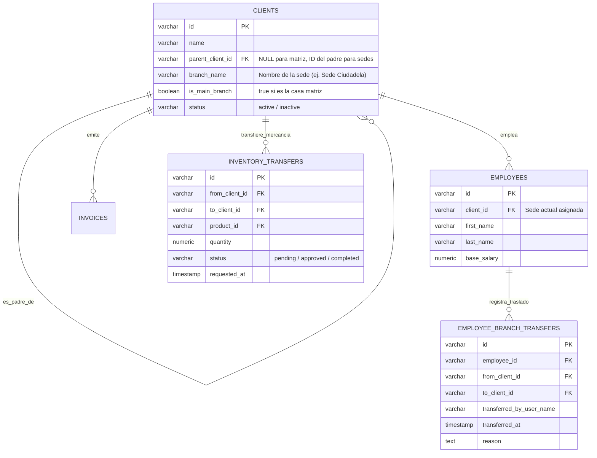

# 🏢 Especificación Técnica: Módulo Multi-Sede & Traslado de Personal

> **Fecha de Especificación:** 31 de Agosto, 2026  
> **Estado:** Especificación Arquitectónica Aprobada  
> **Ubicación en Repositorio:** `docs/ARQUITECTURA_MULTI_SEDE_Y_TRASLADO_EMPLEADOS.md`

---

## 📌 1. Visión General y Objetivos

El **Módulo Multi-Sede (Parent-Child Tenant)** permite a empresas en expansión administrar múltiples puntos de venta, sucursales y bodegas bajo un único grupo empresarial matriz. 

### Principios Fundamentales:
1. **Autonomía Total por Sede**: Cada sede es una tienda real e independiente en la base de datos con su propio `id` (`client_id`). Mantiene su propia facturación, inventario local, arqueo de caja, clientes y contabilidad aislada.
2. **Jerarquía Matriz / Sucursal**: Una tienda matriz (`parent_client_id IS NULL`) administra y agrupa a sus sedes hijas (`parent_client_id = 'optica_la_8'`).
3. **Traslado Transparente de Empleados**: Los trabajadores pueden ser reubicados de una sede a otra con un clic. Su historial pasado (ventas, citas, comisiones, turnos de caja) se conserva 100% en la sede original, mientras que su operación presente/futura se registra en la sede de destino.
4. **Modelo Comercial Add-on**: En lugar de cobrar un plan completo de suscripción por cada punto de venta, la sede matriz paga una tarifa adicional recurrente (Add-on) por cada sede secundaria activa.

---

## 🗄️ 2. Diseño de Base de Datos y Esquemas SQL



### Script de Migración SQL:

```sql
-- 1. Modificación de la tabla clients para jerarquía Multi-Sede
ALTER TABLE clients 
ADD COLUMN IF NOT EXISTS parent_client_id VARCHAR(50) REFERENCES clients(id) ON DELETE CASCADE,
ADD COLUMN IF NOT EXISTS branch_name VARCHAR(150),
ADD COLUMN IF NOT EXISTS is_main_branch BOOLEAN DEFAULT true;

CREATE INDEX IF NOT EXISTS idx_clients_parent_client_id ON clients(parent_client_id);

-- 2. Tabla de Auditoría de Traslados de Empleados entre Sedes
CREATE TABLE IF NOT EXISTS employee_branch_transfers (
    id VARCHAR(50) PRIMARY KEY DEFAULT gen_random_uuid()::text,
    employee_id VARCHAR(50) NOT NULL REFERENCES employees(id) ON DELETE CASCADE,
    from_client_id VARCHAR(50) NOT NULL REFERENCES clients(id),
    to_client_id VARCHAR(50) NOT NULL REFERENCES clients(id),
    transferred_by_user_name VARCHAR(150) NOT NULL,
    reason TEXT,
    transferred_at TIMESTAMP WITH TIME ZONE DEFAULT NOW()
);

CREATE INDEX IF NOT EXISTS idx_emp_transfers_emp_id ON employee_branch_transfers(employee_id);

-- 3. Tabla de Traspasos de Inventario entre Sedes
CREATE TABLE IF NOT EXISTS inventory_transfers (
    id VARCHAR(50) PRIMARY KEY DEFAULT gen_random_uuid()::text,
    from_client_id VARCHAR(50) NOT NULL REFERENCES clients(id),
    to_client_id VARCHAR(50) NOT NULL REFERENCES clients(id),
    product_id VARCHAR(50) NOT NULL REFERENCES products(id),
    product_name VARCHAR(200) NOT NULL,
    quantity NUMERIC(12,2) NOT NULL,
    status VARCHAR(20) DEFAULT 'completed', -- pending, approved, completed, rejected
    requested_by_user VARCHAR(150) NOT NULL,
    notes TEXT,
    created_at TIMESTAMP WITH TIME ZONE DEFAULT NOW()
);
```

---

## 🖥️ 3. Componentes Frontend & Flujo de Usuario

### 3.1. Creación de Nueva Sede (`SaaSErpStoreSettings.tsx`)
- En la pestaña **"Configuración del Negocio"**, se añade la sección **"Gestión Multi-Sede"**.
- Muestra el listado de sedes activas y el botón **"+ Agregar Nueva Sede (Add-on)"**.
- **Campos del Formulario**:
  - Nombre de la Sede (ej. `Óptica Sede Ciudadela`).
  - Dirección física y teléfono de contacto local.
  - Asignación de Encargado de Sede.
  - Copiar catálogo inicial de productos (opcional).

### 3.2. Selector de Sede ("Store Switcher") en `ClientDashboard.tsx`
- Cuando la empresa matriz tiene 1 o más sedes hijas, la barra superior del Dashboard despliega un **Selector de Sede**:
  - `🌐 Consolidado Empresarial (Todas las Sedes)`
  - `📍 Sede Matriz (La 8)`
  - `📍 Sede La 21`
  - `📍 Sede Ciudadela`
  - `📍 Sede Country`
- Al seleccionar una sede individual, todas las vistas (POS, Inventario, Arqueo de Caja, Ventas) se filtran de forma aislada para esa sede especifica.

### 3.3. Reubicación / Traslado de Empleados (`SaaSErpEmployees.tsx`)
- En la lista de colaboradores, cada empleado presenta la opción **"Trasladar de Sede"**.
- **Modal de Traslado**:
  - Seleccionar Sede de Destino.
  - Ingresar Motivo (ej. *Reemplazo por vacaciones, Traslado definitivo*).
- **Garantía de Trazabilidad**:
  - El campo `employees.client_id` se actualiza al nuevo `to_client_id`.
  - Se inserta un registro inmutable en `employee_branch_transfers`.
  - Las facturas y citas pasadas continúan asociadas históricamente a la sede previa en la que fueron creadas.

---

## 🔌 4. Endpoints de API REST (`src/server.ts`)

| Método | Ruta | Descripción |
|---|---|---|
| `GET` | `/api/clients/:clientId/branches` | Obtiene la lista de todas las sedes hijas pertenecientes al negocio matriz |
| `POST` | `/api/clients/:clientId/branches` | Crea una nueva sede hija anclada a `parent_client_id` |
| `POST` | `/api/clients/:clientId/employees/:employeeId/transfer` | Traslada un empleado a otra sede registrando auditoría |
| `GET` | `/api/clients/:clientId/employees/:employeeId/transfers-history` | Obtiene el historial de sedes en las que ha trabajado el empleado |
| `POST` | `/api/clients/:clientId/inventory/transfer` | Realiza un traspaso de mercancía entre sedes desfalco/incremento automático |
| `GET` | `/api/clients/:clientId/planning/consolidated-metrics` | Devuelve ventas, inventario y métricas sumadas de todas las sedes |

---

## 📌 5. Próximos Pasos para Ejecución

1. **Fase 6A**: Ejecutar la migración SQL para habilitar `parent_client_id` y `employee_branch_transfers`.
2. **Fase 6B**: Desarrollar los endpoints de backend en `server.ts` para CRUD de sedes y traslado de empleados.
3. **Fase 6C**: Implementar la UI de Creación de Sede en `SaaSErpStoreSettings.tsx` y el Selector de Sede en `ClientDashboard.tsx`.
4. **Fase 6D**: Implementar el modal de traslado de trabajadores en `SaaSErpEmployees.tsx` y pruebas de trazabilidad.
