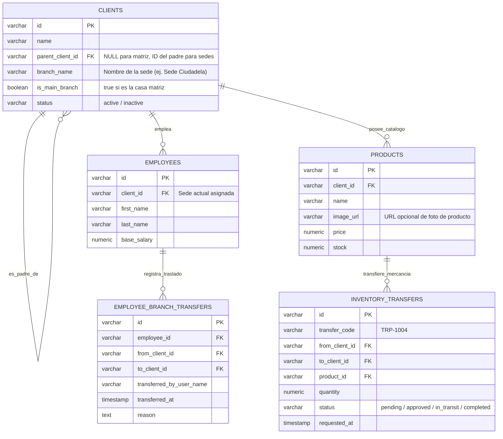

# 🏢 Especificación Técnica: Módulo Multi-Sede, Fotos de Producto & Traslado de Personal

> **Fecha de Especificación:** 31 de Agosto, 2026  
> **Estado:** Especificación Arquitectónica Definitiva  
> **Ubicación en Repositorio:** `docs/ARQUITECTURA_MULTI_SEDE_Y_TRASLADO_EMPLEADOS.md`

---

## 📌 1. Visión General y Objetivos

El **Módulo Multi-Sede (Parent-Child Tenant)** permite a empresas en expansión administrar múltiples puntos de venta, sucursales y bodegas bajo un único grupo empresarial matriz. 

### Principios Fundamentales:
1. **Autonomía Total por Sede**: Cada sede es una tienda real e independiente en la base de datos con su propio `id` (`client_id`). Mantiene su propia facturación, inventario local, arqueo de caja, clientes y contabilidad aislada.
2. **Jerarquía Matriz / Sucursal**: Una tienda matriz (`parent_client_id IS NULL`) administra y agrupa a sus sedes hijas (`parent_client_id = 'optica_la_8'`).
3. **Consulta de Stock Inter-Sedes**: Desde el punto de venta (POS) o inventario, cualquier vendedor puede consultar si un producto agotado está disponible en otra sede y solicitar un traspaso o reservar la unidad para el cliente.
4. **Fotografía de Producto (Opcional)**: Campo multimedios para subir fotos a productos (opcional, no obligatorio), visibles en el catálogo POS, consulta inter-sedes y e-commerce.
5. **Traslado Transparente de Empleados**: Los trabajadores pueden ser reubicados de una sede a otra con un clic. Su historial pasado (ventas, citas, comisiones, turnos de caja) se conserva 100% en la sede original, mientras que su operación presente/futura se registra en la sede de destino.
6. **Modelo Comercial Add-on**: La sede matriz paga una tarifa adicional recurrente (Add-on por tienda) por cada sede secundaria activa.

---

## 🗄️ 2. Diseño de Base de Datos y Esquemas SQL



### Script de Migración SQL:

```sql
-- 1. Soporte para Fotografía Opcional de Producto
ALTER TABLE products 
ADD COLUMN IF NOT EXISTS image_url TEXT;

-- 2. Modificación de la tabla clients para jerarquía Multi-Sede
ALTER TABLE clients 
ADD COLUMN IF NOT EXISTS parent_client_id VARCHAR(50) REFERENCES clients(id) ON DELETE CASCADE,
ADD COLUMN IF NOT EXISTS branch_name VARCHAR(150),
ADD COLUMN IF NOT EXISTS is_main_branch BOOLEAN DEFAULT true;

CREATE INDEX IF NOT EXISTS idx_clients_parent_client_id ON clients(parent_client_id);

-- 3. Tabla de Auditoría de Traslados de Empleados entre Sedes
CREATE TABLE IF NOT EXISTS employee_branch_transfers (
    id VARCHAR(50) PRIMARY KEY DEFAULT gen_random_uuid()::text,
    employee_id VARCHAR(50) NOT NULL REFERENCES employees(id) ON DELETE CASCADE,
    from_client_id VARCHAR(50) NOT NULL REFERENCES clients(id),
    to_client_id VARCHAR(50) NOT NULL REFERENCES clients(id),
    transferred_by_user_name VARCHAR(150) NOT NULL,
    reason TEXT,
    transferred_at TIMESTAMP WITH TIME ZONE DEFAULT NOW()
);

-- 4. Tabla de Traspasos e Interconsulta de Inventario entre Sedes
CREATE TABLE IF NOT EXISTS inventory_transfers (
    id VARCHAR(50) PRIMARY KEY DEFAULT gen_random_uuid()::text,
    transfer_code VARCHAR(50) NOT NULL UNIQUE,
    from_client_id VARCHAR(50) NOT NULL REFERENCES clients(id),
    to_client_id VARCHAR(50) NOT NULL REFERENCES clients(id),
    product_id VARCHAR(50) NOT NULL REFERENCES products(id),
    product_name VARCHAR(200) NOT NULL,
    quantity NUMERIC(12,2) NOT NULL,
    status VARCHAR(30) DEFAULT 'completed', -- pending, approved, in_transit, completed, rejected
    requested_by_user VARCHAR(150) NOT NULL,
    notes TEXT,
    created_at TIMESTAMP WITH TIME ZONE DEFAULT NOW()
);
```

---

## 🔍 3. Consulta de Stock Inter-Sedes & Reserva Exprés

1. **Botón en POS e Inventario**: Al lado de cada producto o cuando el stock local es `0`, se dispone de **"🔍 Ver Stock en Otras Sedes"**.
2. **Desglose en Tiempo Real**:
   ```
   📍 Sede La 8 (Actual):   0 ud. (Agotado)
   📍 Sede La 21:           5 ud. (Disponible) [Reservar / Solicitar Traspaso]
   📍 Sede Ciudadela:       2 ud. (Disponible) [Reservar / Solicitar Traspaso]
   ```
3. **Traspaso por Guía / QR**: Genera una guía interna con código QR. Al llegar la mercancía a la sede de destino, se escanea el QR para confirmar el inventario recibido sin digitación manual.

---

## 🖼️ 4. Fotografía Opcional de Producto

- Campo `image_url` (subida a Google Drive / Almacenamiento local del servidor).
- **No Obligatorio**: Si el producto no posee imagen, la interfaz muestra el avatar con las iniciales o categoría con diseño estético premium.
- **Uso de Imágenes**: Renderizado en el catálogo táctil de POS, listado de inventario, catálogo del Bot de WhatsApp y sincronización con e-commerce (Shopify/WooCommerce).

---

## 🖥️ 5. Componentes Frontend & Flujo de Usuario

### 5.1. Creación de Nueva Sede (`SaaSErpStoreSettings.tsx`)
- Botón **"+ Agregar Nueva Sede (Add-on)"** en Configuración de Negocio.
- Campos: Nombre de la Sede, Dirección, Teléfono y Encargado.

### 5.2. Selector de Sede ("Store Switcher") en `ClientDashboard.tsx`
- Desplegable superior para cambiar entre la vista **Consolidada Matriz** o una sede específica.

### 5.3. Reubicación / Traslado de Empleados (`SaaSErpEmployees.tsx`)
- Modal **"Trasladar de Sede"** actualizando `employees.client_id` e insertando auditoría en `employee_branch_transfers`.

---

## 🔌 6. Endpoints de API REST (`src/server.ts`)

| Método | Ruta | Descripción |
|---|---|---|
| `GET` | `/api/clients/:clientId/branches` | Obtiene la lista de todas las sedes hijas del negocio matriz |
| `POST` | `/api/clients/:clientId/branches` | Crea una nueva sede hija anclada a `parent_client_id` |
| `GET` | `/api/clients/:clientId/products/cross-branch-stock` | Consulta el stock disponible de un producto en todas las sedes del grupo |
| `POST` | `/api/clients/:clientId/employees/:employeeId/transfer` | Traslada un empleado a otra sede registrando auditoría |
| `POST` | `/api/clients/:clientId/inventory/transfer` | Realiza un traspaso de mercancía entre sedes con guía de envío |
