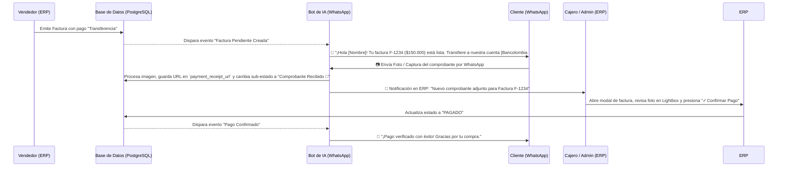

# Documento de Especificaciones Técnicas y Plan de Implementación
## Flujo Automatizado de Pagos por Transferencia (IA + WhatsApp) y Módulo de Facturación ERP

---

## 📌 1. Resumen Ejecutivo y Estado Actual (Fase 1 - Implementado)

Se han implementado mejoras clave en el módulo de facturación ERP (`SaaSErpInvoices.tsx`), permitiendo la búsqueda, filtrado avanzado, auditoría de soportes de pago y visualización completa 360° de las ventas.

### 1.1. Buscador y Filtros Avanzados
- **Buscador Global Instantáneo:** Filtrado en tiempo real por Nombre del Cliente, N° de Factura (*ej. F-2102*), Teléfono de WhatsApp o Cédula/NIT.
- **Filtro de Estado:** Selector rápido entre `Todas las Facturas`, `✅ Pagadas`, `⏳ Pendientes` y `🔴 En Mora`.
- **Filtros Avanzados Desplegables:** Rango de Fechas (*Desde / Hasta*) y Rango de Montos (*Monto Mínimo / Máximo*).

### 1.2. Selector Dinámico de Bancos Origen
- Selector con los bancos más comunes en Colombia (*Bancolombia, Nequi, Daviplata, Davivienda, Banco de Bogotá, BBVA, Banco Agrario, Scotiabank Colpatria, Banco Popular, AV Villas, Itaú, Nu Bank, Lulo Bank, RappiPay, Bold / Mercado Pago*).
- Opción **`➕ Otro / Banco Extranjero...`** con campo de texto libre para bancos internacionales.

### 1.3. Modal 360° de Detalle Completo & Visor Lightbox Fullscreen
- Estructura con z-index corregido (`z-[9999]`), cabecera y pie de página pegajosos (*sticky top-0 / sticky bottom-0*), asegurando que el botón de cerrar (`X`) y los botones de acción nunca se recorten ni se pierdan.
- Muestra la información del cliente, condiciones de pago, datos bancarios de origen y destino, y la lista detallada de productos comprados (*incluyendo parámetros de laboratorio de lentes ópticos*).
- **Visor Lightbox de Comprobantes (`payment_receipt_url`):** Muestra vista previa (miniatura) del soporte de pago y permite abrir un visor gigante a pantalla completa (`z-[10000]`) para auditar la transferencia.

### 1.4. Gráfico de Tendencia Diaria de Ventas con Tooltips Flotantes (Módulo Contabilidad)
- **Tooltip Flotante al Pasar el Cursor (Hover):** Implementada notita/tarjeta emergente interactiva (`group-hover:opacity-100`) que se ubica exactamente sobre el puntero/barra con fecha en formato legible, recaudo total en COP y número de ventas realizadas.
- **Etiquetas de Monto Directo:** Visualización directa del valor abreviado (*ej. $347k, $1.2M*) encima de cada barra sin necesidad de interacción.
- **Visualización sin Recortes:** Contenedor optimizado con `overflow-y-visible` para garantizar que los tooltips flotantes nunca se corten en la parte superior.

---

## 🚀 2. Flujo Automatizado de Pagos por Transferencia vía IA en WhatsApp (Fase 2 - Diseño del Plan)

Este flujo busca automatizar la solicitud y recolección de soportes de pago cuando un cliente elige pagar por **Transferencia Bancaria**, reduciendo a 1 clic la verificación por parte del cajero o administrador.

### 🔄 Diagrama de Secuencia del Flujo Automatizado

---

## 🛠️ 3. Especificaciones de Código y Componentes

### 3.1. Modelo de Datos (`invoices` table)
- `transfer_bank`: Nombre del banco origen del cliente (*VARCHAR 100*).
- `transfer_destination_account`: Cuenta destino de la empresa (*VARCHAR 200*).
- `payment_receipt_url`: Enlace/URL del soporte de transferencia enviado por el cliente (*TEXT*).

### 3.2. Endpoints Backend (`server.ts`)
- `GET /api/clients/:clientId/invoices`: Retorna listado de facturas incluyendo campos de transferencia y soporte.
- `GET /api/clients/:clientId/invoices/:invoiceId`: Retorna detalle completo con ítems y cuotas.
- `PUT /api/clients/:clientId/invoices/:invoiceId/receipt`: Actualiza la URL del comprobante de pago.

### 3.3. Motor de IA & WhatsApp (`src/whatsapp.ts`)
1. **Emisión de Mensaje de Cobro:** Al crearse la factura en estado pendiente por transferencia, se construye un mensaje dinámico con las cuentas activas del negocio (`business_bank_accounts`).
2. **Recepción de Foto:** Cuando el cliente responde con una imagen y posee una factura pendiente, la IA descarga el archivo multimedia, lo guarda en `/uploads/receipts/` y asocia la URL a la factura.
3. **Notificación al Dashboard:** Actualiza el badge visual a `Soporte 📸` en la tabla de facturas.

---

## 📅 4. Checklist de Ejecución

- [x] Documentar especificaciones en `docs/FLUJO_PAGOS_TRANSFERENCIA_IA_Y_FACTURACION.md`.
- [x] Corregir Z-Index, posición del modal header (`sticky top-0`) y botón de cierre (`X`) en `SaaSErpInvoices.tsx`.
- [x] Implementar tooltips flotantes emergentes (tipo notita en hover) y etiquetas de valor en las barras de contabilidad (`SaaSErpAccounting.tsx`).
- [x] Probar compilación del frontend y servidor en caliente.
