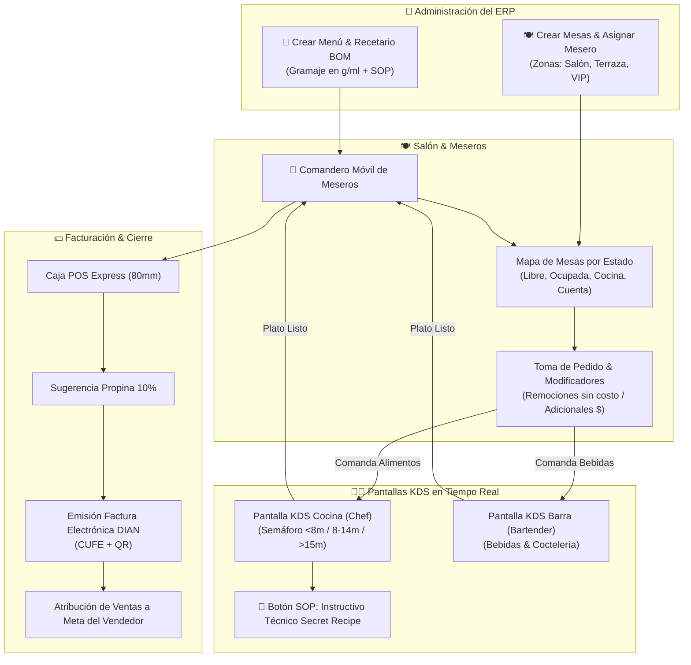

# Módulo Especializado de Restaurantes & Gastronomía (Diaz Lab Food ERP)

Este documento contiene la **especificación técnica, funcional y de arquitectura operativa** para el módulo de Restaurantes, Bares, Cocinas Ocultas y Comiderías. Sirve como documento base permanente del sistema.

---

## 1. Arquitectura General y Flujo de Información

El módulo conecta en tiempo real los puntos neurálgicos de la operación gastronómica:

1. **Administración & Menú**: Creación de platos con receta BOM en gramos/ml, instructivo SOP y creación de mesas por zonas con asignación de meseros responsables.
2. **Mesero / Comandero**: Recepción de pedidos en 3 toques con remociones (sin costo) y adicionales (con costo).
3. **Cocina / Barra (KDS)**: Pantallas táctiles en tiempo real clasificadas por estación con semáforo de tiempo y consulta del instructivo técnico SOP.
4. **Caja Central & DIAN**: Facturación POS, sugerencia de propina del 10%, emisión DIAN con CUFE y atribución a la meta del vendedor.

---

## 2. Especificación de Funcionalidades

### A. Módulo Especializado de Inventario de Insumos & Materias Primas (`raw_materials`)
- **Diseño de Interfaz Dedicada Exclusiva para Cocina**: Pestaña **"Inventario de Insumos & Ingredientes"** separada del catálogo de ventas comercial.
- **Unidad de Compra vs. Unidad de Consumo (Conversión de Unidades)**:
  - *Unidades de Compra*: Bulto, Kilogramo, Libra (454g), Garrafa, Arroba, Caja, Unidad.
  - *Unidades de Consumo Interno*: Gramos (g), Mililitros (ml), Unidades (unid).
- **Ejemplo de Cálculo Automatizado**:
  - Si el restaurante registra la compra de **1 Bulto de Papa Sabanera (50 kg)** por **$100.000 COP**:
    - Costo por Kilo: `$2.000 COP/kg`
    - Costo por Gramo: `$2,00 COP/g`
    - Stock disponible en bodega: `50.000 gramos`.
- **Descuento Automático de Bodega por Venta**: Al facturar 1 plato del menú (ej. *Hamburguesa con 150g de papa*), el ERP deduce automáticamente `150g` del stock de la papa.
- **Alertas de Stock Crítico**: Notificación cuando el stock acumulado cae por debajo del nivel mínimo de reabastecimiento en gramos/kilos.

### B. Mapa de Mesas, Creación & Asignación de Meseros
- **Creación & Configuración de Mesas**: Botón `+ Crear / Configurar Mesa` para registrar número/código de mesa, zona (Salón Principal, Terraza, VIP, Barra) y capacidad de comensales.
- **Asignación de Mesero Responsable**: Cada mesa puede tener asignado un mesero específico (o selector rápido desplegable para reasignar meseros en tiempo real).
- **Mapa por Zonas**: Visualización gráfica por código de color (🟢 *Libre*, 🔴 *Ocupada*, 🟡 *En Cocina*, 🔵 *Pidiendo Cuenta*).
- **Toma de Pedido Táctil**: Selección de ítems en 3 toques.
- **Personalización de Platos (Modificadores)**:
  - **Remociones (Sin Costo)**: Notas de cocina (ej. *"Sin cebolla"*, *"Término 3/4"*).
  - **Adicionales (Con Costo)**: Ingredientes extra con precio adicional (ej. *"Tocineta extra +$4.000"*).
- **Notificación de Entrega**: Alerta en la pantalla del mesero cuando la cocina marca un plato como *"Listo"*.

### C. Pantallas de Cocina y Barra (KDS - Kitchen Display System)
- **Separación de Estaciones**: Las comandas de alimentos se envían a la Pantalla de Cocina (Chef) y las bebidas/cócteles a la Pantalla de Barra (Bartender).
- **Semáforo de Tiempo de Preparación**:
  - 🟢 **Verde**: 0 - 8 minutos.
  - 🟡 **Amarillo**: 8 - 14 minutos.
  - 🔴 **Rojo**: +15 minutos (Alerta de demora).
- **Acción de Estado**: Botón táctil *"Iniciar Preparación"* y *"Marcar Listo"*.

### D. Punto de Venta (POS) & Políticas de Pago
- **Cobro Flexible**:
  - *Modo Autoservicio / Comida Rápida*: Pago previo al envío a cocina.
  - *Modo Restaurante Tradicional*: Pago al finalizar el servicio.
- **División de Cuentas**: División equitativa o por consumos individuales.
- **Propina Voluntaria del 10%**: Sugerida automáticamente sobre el subtotal, con opción de modificar o exonerar a solicitud del cliente.
- **Facturación**: Impresión en tiquete térmico 80mm y emisión de Factura Electrónica DIAN con CUFE y QR.

### F. Recetario Digital e Instructivo Técnico de Preparación (SOP / Secret Recipe - Planes Avanzados)
- **Ficha Técnica del Plato**: Espacio donde el propietario o Chef Ejecutivo almacena el procedimiento paso a paso de preparación de cada plato.
- **Estandarización de Sabor**: Incluye fotos del emplatado final, secretos de sazón, temperaturas de cocción y tiempos exactos.
- **Continuidad Operativa**: Si el restaurante cambia de cocinero o contrata personal nuevo, el empleado consulta el instructivo desde su pantalla KDS/Tablet y replica la receta manteniendo exactamente la esencia, presentación y calidad del restaurante.

### G. Creación de Menú Digital & Gramaje por Insumo (BOM por Peso)
- **Formulario de Creación de Plato**: Nombre, categoría del menú (Entradas, Fuertes, Bebidas, Postres), precio comercial, foto y descripción.
- **Desglose en Gramos / ML**: El usuario ingresa la cantidad exacta en gramos, mililitros o unidades de cada insumo que compone el plato (ej. *200g Carne de Res, 40g Queso, 150g Papas*).
- **Guía de Inventario**: Leyenda informativa recomendando ingresar el peso exacto para garantizar el descuento automático del inventario de insumos comprado por Libra o Kilogramo.

### H. Historial de Variación de Precios de Insumos & Estrategia de Margen
- **Bitácora Volátil de Costos**: Cada vez que se registra una compra o cambia el costo de un insumo (ej. subida en la carne o verduras), el sistema guarda un registro en el historial (`raw_material_price_history`).
- **Análisis de Impacto en Utilidad**: Al subir el costo de un insumo, el módulo de planeación analiza 3 alternativas estratégicas:
  1. *Conservar Precio de Venta*: Evalúa la pérdida de porcentaje de margen (ej. baja del 45% al 38%) y alerta si está en rango aceptable.
  2. *Ajuste de Precio Comercial*: Sugiere el nuevo precio de venta recomendado para mantener el margen neto objetivo.
  3. *Porcionado Inteligente (Shrinkflation Controlada)*: Recomienda el ajuste exacto en gramos por plato para conservar el precio final sin sacrificar rentabilidad.

### I. Estándar de la Industria: Gestión de Mermas y Escandallo de Carnes
Cualquier análisis, costeo o consulta de porcionado en el ERP sigue estrictamente las 4 reglas fundamentales gastronómicas:

1. **Estándar de Menú y Gramaje en Carta**:
   - El peso declarado en carta (ej. *250g, 300g*) corresponde **siempre al peso en crudo** tras la merma primaria y antes de la cocción.
   - *Sin compensación física en cocina*: No se añaden gramos extra para compensar lo que encogerá al cocinar, ya que la merma por cocción es una variable móvil según el término solicitado (*Azul, Medio 15% vs. Bien Cocido +35%*).

2. **Clasificación Estándar de Mermas**:
   - **Merma Primaria (Limpieza y Porcionado)**: Tejido no utilizable antes de cocinar (grasa excesiva, nervios, tendones, hueso). Determina el costo real por gramo limpio en crudo.
   - **Merma Secundaria (Cocción y Pérdida Térmica)**: Pérdida de agua, jugos y grasa durante la cocción (15% a +35%).

3. **Integración en el Costeo (Escandallo Financiero)**:
   - La merma no se ajusta modificando la porción del plato, sino **financieramente en la ficha técnica (escandallo)**.
   - El Precio de Venta Público (PVP) absorbe el costo real del insumo limpio para mantener el margen bruto objetivo, dejando que la merma secundaria sea la reducción física natural servida al comensal.

4. **Modelos de Excepción (Cobro por Peso Cocido / Servido)**:
   - Aplica únicamente a ahumaderos BBQ estilo Texas (brisket, pulled pork), carnicerías-asadero por peso y buffets por gramo, donde el precio ya incluye la amortización total de las mermas primaria y secundaria.

---

## 3. Matriz de Roles y Permisos por Sector

Cuando una empresa tiene la categoría `restaurante`, el **Portal de Empleados** ajusta la interfaz según el rol:

| Rol | Perfil de Pantalla | Permisos Principales |
|---|---|---|
| 🍽️ **`mesero`** | Comandero Móvil | Mapa de mesas, toma de comandas, notas/modificadores, estado de platos, propinas del turno. |
| 👨‍🍳 **`cocinero`** | Pantalla KDS Cocina | Visualización de comandas de comida, notas de preparación, temporizador, marca de listo. |
| 🍹 **`bartender`** | Pantalla KDS Barra | Comandas de bebidas, licores y cócteles. |
| 💵 **`caja`** | POS Express | Cierre de cuentas, propinas, impresión 80mm, emisión DIAN, arqueo de caja. |
| 🤵 **`capitan_meseros`** | Panel Salón | Supervisión de zonas, reasignación de mesas y anulación autorizada de ítems. |
| 🛵 **`delivery`** | App Domiciliario | Hojas de ruta de entregas, navegación GPS y cobro contra-entrega. |
| 👑 **`admin`** | ERP General | Control total de menús, recetas (BOM), ventas, márgenes, propinas y auditoría. |

---

## 4. Estructura de Datos (Esquema de Migración)

- `restaurant_tables`: id, client_id, table_number, zone, capacity, status (`free`, `occupied`, `waiting_food`, `billing`).
- `product_recipes`: id, client_id, product_id (plato), raw_product_id (insumo), quantity_required, unit_of_measure.
- `kitchen_orders`: id, client_id, table_id, invoice_id, station (`kitchen` / `bar`), status (`pending`, `in_preparation`, `ready`), prep_time_minutes, created_at.
- `dish_modifiers`: id, kitchen_order_item_id, type (`removal` / `addition`), name, extra_price.
- `raw_material_price_history`: id, client_id, product_id, previous_cost, new_cost, changed_at, supplier_id.

---

## 5. Estudio de Viabilidad: Marketplace B2B de Proveedores para Restaurantes (Red Mayorista B2B)

### A. Concepto del Proyecto (Modelo de Exposición B2B Sin Carga Logística)
Una vitrina o mercado público virtual integrado dentro de Diaz Lab ERP donde **proveedores mayoristas** (distribuidores de carnes, verduras, lácteos, empaques y licores) adquieren exposición para venderle directo a los restaurantes afiliados.

### B. Modelo Operativo: Despacho Directo por el Proveedor (Vendor Direct Fulfillment)
- **Cero Riesgo u Operación Logística para Diaz Lab**: Diaz Lab **NO asume bodegas, ni flota de transporte, ni fletes, ni garantías de mercancía, ni devoluciones**.
- **Responsabilidad del Proveedor**: Cada mayorista administra su propio stock, sus bodegas y su logística de entrega.
- **Rol de la Plataforma**: Diaz Lab actúa exclusivamente como el **conector tecnológico y canal de ventas**, otorgándole exposición masiva al proveedor ante la comunidad de restaurantes del ERP.

### C. Análisis de Viabilidad & Estrategias de Monetización

1. **Monetización por Comisión B2B / Membresía de Proveedor**:
   - Los restaurantes emiten sus Órdenes de Compra directamente en la plataforma.
   - Diaz Lab cobra un **% de comisión por venta al proveedor mayorista** (ej. 2% - 4% sobre la orden) o un plan de membresía destacado por exposición, generando ingresos recurrentes de alto margen sin ningún costo operativo de transporte.

2. **Plus Comercial para Captar Restaurantes (Imán de Clientes)**:
   - Ofrecer el Marketplace como valor agregado único: *"Al usar Diaz Lab ERP, accedes a una red de proveedores mayoristas con precios directos de bodega, lo que ahorra hasta un 12% en tu costo de insumos"*.

3. **Sugerencia Inteligente de Reabastecimiento**:
   - Al alcanzar el stock mínimo de un insumo en el ERP (ej. < 5 kg de carne), la plataforma genera la sugerencia de orden de compra enviando la solicitud directamente al proveedor seleccionado.

---

*Diaz Lab Food ERP — Especificación Técnica y Estratégica del Módulo Gastronómico.*
