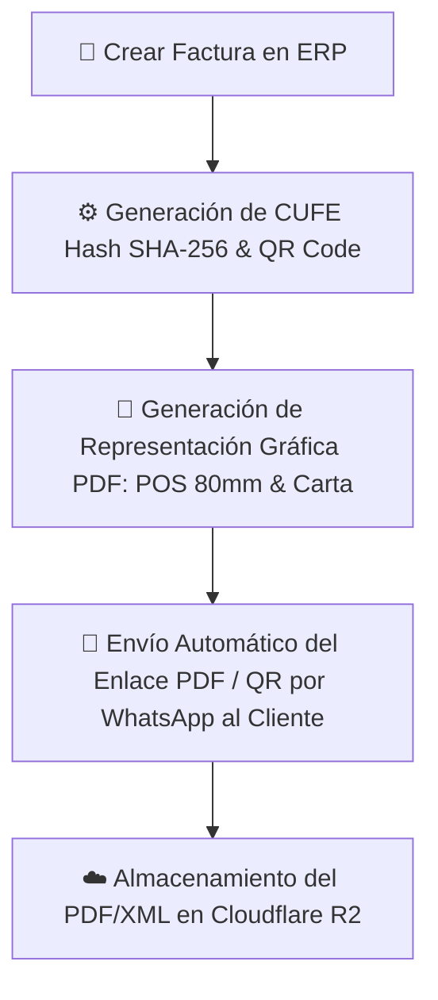

## 🎯 1. Objetivos del Módulo

1. **Gestión de Planes y Suscripciones (SaaS & Monetización por Niveles):**
   - **Plan Básico / Estándar:** Facturación POS local, Inventarios, CRM, WhatsApp Bot (sin emisión DIAN).
   - **Plan Pro / Premium:** Todo lo del Básico + **Facturación Electrónica DIAN Oficial** (con cupo de folios mensuales, ej: 100 facturas/mes) + Notificaciones proactivas de PDF/QR por WhatsApp.
   - **Plan Enterprise:** Facturas electrónicas ilimitadas + Múltiples sucursales y firmas digitales.

2. **Feature Gating (Control de Acceso por Plan):**
   - Restricción automática de la emisión de Factura Electrónica DIAN según el plan contratado por la tienda. Si una tienda en Plan Básico intenta emitir una Factura Electrónica, el sistema despliega un banner de **Upgrade de Plan**.

3. **Métodos de Pago Flexibles y Mixtos:**
   - Soportar pagos combinados (ej: Efectivo + Nequi, Tarjeta + Transferencia) y pasarelas de pago electrónico (PSE, Nequi, Tarjeta).

4. **Facturación Electrónica Fiscal (DIAN / Estándar Electrónico):**
   - Generación automática de **CUFE** (Código Único de Factura Electrónica), Hash SHA-256/384 de seguridad, Código **QR Fiscal** de validación y estructura JSON/XML.
   - Generación e impresión de la Representación Gráfica de la Factura Electrónica en PDF en formatos **POS 80mm** (Tiquete térmico) y **Formato Carta**.

---

## 🏗️ 2. Arquitectura de Base de Datos Propuesta

```sql
-- 1. Tabla de Planes de Suscripción
CREATE TABLE IF NOT EXISTS subscription_plans (
    id UUID PRIMARY KEY DEFAULT gen_random_uuid(),
    client_id VARCHAR(50) NOT NULL REFERENCES clients(id) ON DELETE CASCADE,
    name VARCHAR(100) NOT NULL,
    description TEXT,
    price NUMERIC(10, 2) NOT NULL,
    billing_cycle VARCHAR(20) DEFAULT 'monthly', -- monthly, quarterly, annual
    features JSONB,
    is_active BOOLEAN DEFAULT TRUE,
    created_at TIMESTAMP DEFAULT CURRENT_TIMESTAMP
);

-- 2. Modificaciones a la tabla de Facturas (Facturación Electrónica & Pagos Mixtos)
ALTER TABLE invoices ADD COLUMN IF NOT EXISTS cufe VARCHAR(100);
ALTER TABLE invoices ADD COLUMN IF NOT EXISTS qr_code_url TEXT;
ALTER TABLE invoices ADD COLUMN IF NOT EXISTS electronic_status VARCHAR(30) DEFAULT 'draft'; -- draft, signed, sent_dian, accepted, rejected
ALTER TABLE invoices ADD COLUMN IF NOT EXISTS payment_breakdown JSONB; -- Ej: [{ method: 'efectivo', amount: 50000 }, { method: 'nequi', amount: 100000 }]
ALTER TABLE invoices ADD COLUMN IF NOT EXISTS plan_id UUID REFERENCES subscription_plans(id) ON DELETE SET NULL;
```

---

## 🔄 3. Flujo de Facturación Electrónica y Representación Gráfica



---

## 📅 Componentes a Crear / Modificar

1. **`src/services/electronicInvoiceService.ts` [NUEVO]:**
   - Calculador de CUFE hash, generador de Código QR fiscal DataMatrix/QR Code y formateador de XML/JSON electrónico.
2. **`src/services/pdfGeneratorService.ts` [NUEVO]:**
   - Generador HTML a PDF de la Factura Electrónica en formato Tiquete Térmico POS (80mm) y Carta.
3. **`dashboard/src/components/SaaSErpInvoices.tsx` [MODIFICAR]:**
   - Agregar selector de Pago Mixto (múltiples métodos), botón de *Generar Factura Electrónica DIAN*, vista previa de Código QR / CUFE e impresión directa de tiquete POS.
4. **`dashboard/src/components/SaaSErpPlans.tsx` [NUEVO]:**
   - Panel de administración de Planes y Suscripciones recurrentes.
