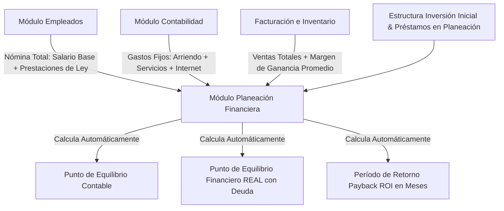

# 🏛️ Plan Arquitectónico: Módulo de Finanzas & Planeación Empresarial de Élite + Sistema IA AutoFix & Tickets

> **Fecha:** 31 de Agosto, 2026  
> **Estado:** Aprobado para Ejecución  
> **Ubicación en Repositorio:** `docs/PLAN_FINANZAS_Y_SISTEMA_IA_AUTOFIX.md`

---

## 🎯 1. Visión General del Proyecto

Este documento establece la especificación técnica y de negocio permanente para dos extensiones estratégicas de la plataforma ERP SaaS Multi-Tenant:

1. **Módulo de Finanzas & Planeación Empresarial de Élite (`EnterprisePlanningModule.tsx` & `SaaSErpAccounting.tsx`)**:
   - Eliminación total de redundancia de datos.
   - Cruce automático en tiempo real de **Nómina Completa** (Salario base + Carga prestacional y seguridad social del empleador).
   - Cruce automático de **Gastos Fijos Operativos** desde Contabilidad (Arriendo, Servicios Públicos, Internet, Mantenimiento).
   - Registro de **Inversión Inicial (CAPEX & Montaje)** y **Estructura de Capital / Préstamos Bancarios** con tabla de amortización y cuota mensual fija.
   - Cálculo del **Punto de Equilibrio Contable** vs. **Punto de Equilibrio Financiero REAL** (Caja Real incluyendo el servicio a la deuda) y tiempo de retorno de la inversión (**Payback ROI** en meses).

2. **Sistema de IA AutoFix & Tickets de Soporte (`src/agents/autoFixAgent.ts` & `SaaSErpSupportTickets.tsx`)**:
   - Sistema de soporte técnico y auto-reparación autónoma acotada.
   - Captura automática de excepciones 500 no manejadas y creación manual de tickets desde la barra superior del ERP.
   - **Reglas Incalculables de Seguridad**:
     - ❌ **CERO `DELETE`**: Jamás se borran registros físicamente de la base de datos (solo actualizaciones de estado auditadas).
     - ❌ **NO Inventar Parámetros**: No muta esquemas de base de datos ni inventa variables inexistentes.
     - ❌ **Sin Ingeniería Inversa**: Si el fallo requiere cambiar código fuente en Node.js o React, la IA detiene acciones a ciegas, sintetiza la causa raíz y **escala un Ticket de Ingeniería** al equipo de desarrollo humano vía WhatsApp/Email.

---

## 📊 2. Arquitectura de Flujo de Datos Financieros (Sin Redundancia)



### A. Gastos Fijos Operativos (Ubicación: `SaaSErpAccounting.tsx`)
Se agrega la gestión de Gastos Fijos Recurrentes en Contabilidad:
- **Conceptos**: Arriendo de local, Servicios públicos (Luz, Agua, Gas), Internet/Suscripciones, Mantenimiento.
- **Función**: Le permite al Módulo Contable calcular la **Utilidad Neta Real** del mes y alimenta automáticamente a Planeación Empresarial.

### B. Inversión Inicial & Préstamos Bancarios (Ubicación: `EnterprisePlanningModule.tsx`)
Se configura por única vez la Estructura de Montaje y Financiamiento:
- **Inversión Inicial (CAPEX)**:
  - Adecuaciones del local y obras civiles.
  - Mobiliario y decoración.
  - Maquinaria, equipos e instrumentos médicos/operativos.
  - Inventario inicial de apertura.
  - Licencias y gastos pre-operativos.
  - Fondo de maniobra (caja de reserva).
- **Préstamos Bancarios & Deuda**:
  - Entidad financiera (Bancolombia, Davivienda, etc.).
  - Monto desembolsado ($ COP).
  - Tasa de interés (% Efectivo Mensual).
  - Plazo en meses.
  - **Cuota Mensual Amortizada** (serviciada automáticamente al cálculo del punto de equilibrio).

---

## 🛡️ 3. Especificación Técnica de IA AutoFix

### Modelo de Datos (`support_tickets`):
```sql
CREATE TABLE IF NOT EXISTS support_tickets (
  id UUID PRIMARY KEY DEFAULT gen_random_uuid(),
  client_id UUID NOT NULL REFERENCES clients(id) ON DELETE CASCADE,
  ticket_code VARCHAR(30) UNIQUE NOT NULL,
  created_by_user_name VARCHAR(150) NOT NULL,
  title VARCHAR(255) NOT NULL,
  description TEXT NOT NULL,
  category VARCHAR(50) DEFAULT 'general',
  status VARCHAR(30) DEFAULT 'open', -- 'open', 'ai_fixing', 'ai_resolved', 'escalated_human', 'closed'
  ai_diagnosis TEXT,
  ai_action_taken TEXT,
  stack_trace TEXT,
  created_at TIMESTAMP WITH TIME ZONE DEFAULT NOW(),
  updated_at TIMESTAMP WITH TIME ZONE DEFAULT NOW()
);
```

### Protocolo de Actuación del Agente AutoFix (`autoFixAgent.ts`):
1. **Paso 1 - Lectura de Contexto**: El subagente analiza el ticket, los logs de auditoría (`system_audit_logs`), la traza del error y el estado del tenant.
2. **Paso 2 - Evaluación de Seguridad**:
   - Verifica que el fix NO implique sentencias `DELETE`.
   - Verifica que NO requiera alterar esquemas o inventar atributos.
3. **Paso 3A - Reparación de Estado de Datos (Si es un caso seguro acotado)**:
   - Aplica corrección de estado (ej: marcar sesión de caja desbloqueada, ajustar bandera de sincronización) y responde al cliente marcando el ticket como `ai_resolved`.
4. **Paso 3B - Escalamiento a Desarrollo Humano (Si es un problema de código/infraestructura)**:
   - Sintetiza el informe técnico: *Causa raíz*, *Archivo afectado*, *Línea estimada*, *Propuesta de solución*.
   - Cambia estado a `escalated_human`.
   - Dispara notificación por WhatsApp/Email a los ingenieros de soporte de la agencia.

---

## 📅 4. Roadmap de Ejecución

1. **Paso 1**: Crear esquemas de base de datos en `initDb.ts` (`monthly_fixed_expenses`, `enterprise_initial_investment`, `enterprise_loans`, `support_tickets`).
2. **Paso 2**: Implementar API endpoints de Gastos Fijos en Contabilidad y Modelo Financiero en Planeación (`src/server.ts`).
3. **Paso 3**: Crear componentes frontend de Gastos Fijos en `SaaSErpAccounting.tsx` y rediseñar `EnterprisePlanningModule.tsx`.
4. **Paso 4**: Implementar el Agente IA `src/agents/autoFixAgent.ts` y el portal de tickets `SaaSErpSupportTickets.tsx` con botón en `ClientDashboard.tsx`.
5. **Paso 5**: Compilación, verificación integral y despliegue al servidor VPS (`209.145.50.230`).
