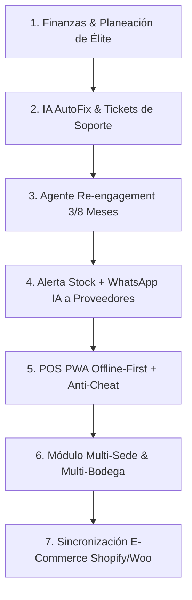

# 🏛️ Plan Maestro Completo: Módulos Estratégicos, IA AutoFix y Escalación Vertical

> **Fecha de Actualización:** 31 de Agosto, 2026  
> **Estado:** Documento Maestro Definitivo con Funcionalidades de Élite  
> **Ubicación en Repositorio:** `docs/PLAN_MAESTRO_ESCALABILIDAD_Y_MODULOS.md`

---

## 📌 Visión General de la Hoja de Ruta

Este documento constituye la guía arquitectónica y funcional completa de la plataforma ERP SaaS Multi-Tenant **Frant**. Contempla los 7 frentes estratégicos de desarrollo y las **6 Funcionalidades de Élite** acordadas para llevar el producto al nivel más alto de competencia internacional (superando a Odoo, NetSuite y Lightspeed).

---

## 🗺️ Los 7 Módulos del Plan Maestro

---

### 🟢 Módulo 1: Finanzas & Planeación Empresarial de Élite
- **Cruce Automático sin Redundancia**:
  - **Nómina Completa**: Salario base + 49.5% de carga prestacional y seguridad social del empleador (Salud, Pensión, ARL, Prima, Cesantías, Int. Cesantías, Vacaciones) leídos de los empleados activos.
  - **Gastos Fijos Operativos**: Pestaña en **Contabilidad** (`SaaSErpAccounting.tsx`) para registrar Arriendo, Servicios Públicos, Internet y Mantenimiento.
  - **Ventas & Margen Promedio**: Calculados automáticamente del inventario y facturación.
- **Inversión Inicial (CAPEX & Montaje)**: Registra adecuaciones, mobiliario, maquinaria, licencias y reserva de caja.
- **Estructura de Capital & Deuda Bancaria**: Registra créditos (Banco, Monto, Tasa % E.M., Plazo) con cálculo automático de la **Cuota Mensual Amortizada**.
- **Indicadores Clave**: Punto de Equilibrio Contable, **Punto de Equilibrio Financiero REAL (con cuota del banco)** y Tiempo de Retorno de Inversión (Payback ROI).

---

### 🟢 Módulo 2: Sistema de IA AutoFix + Tickets de Soporte
- **Reglas Incalculables de Seguridad**:
  - ❌ **CERO `DELETE`**: Jamás se borran datos físicamente (solo actualización de estado auditada).
  - ❌ **NO Inventar Parámetros**: Fixes concretos sin mutar esquemas de BD.
  - ❌ **Sin Ingeniería Inversa**: Si el fallo requiere cambiar código fuente, diagnostica y **escala el ticket a ingenieros humanos** vía WhatsApp/Email.
- **Auto-Captura & Tickets Manuales**: Botón *"Soporte & AutoFix"* en el header y captura automática de excepciones 500.

---

### 🟡 Módulo 3: Agente Proactivo de Re-engagement Específico para Ópticas (A 3 y 8 Meses)
- **A los 3 Meses de la Factura**: El bot de WhatsApp contacta proactivamente al paciente para ofrecerle productos complementarios (kit de limpieza, gotas humectantes, estuche o segundo par de sol con descuento).
- **A los 8 Meses de la Fórmula**: El bot contacta automáticamente al paciente agendando o sugiriendo su **nuevo examen de la vista / revisión optométrica anual preventiva**.

---

### 🟡 Módulo 4: Alerta de Stock Mínimo + Mensaje IA por WhatsApp al Proveedor
- **Monitoreo de Stock Mínimo**: Cuando un producto o insumo cae por debajo de su `stock_minimo`, el ERP dispara una notificación al Administrador e Encargado de Inventario.
- **Cotización/Recompra Autónoma por IA**: Al ser autorizada la recompra con 1 clic, **la IA redacta y envía automáticamente un mensaje por WhatsApp al teléfono del Proveedor** para cotizar o encargar el pedido de reabastecimiento.

---

### 🟡 Módulo 5: POS PWA Offline-First + Temporizador Interno Anti-Cheat
- **Operación Offline Continua**: Empaquetado PWA con Service Worker e IndexedDB para permitir facturar y cobrar sin conexión a internet.
- **Temporizador Anti-Cheat**: Validación de timestamp interno encriptado y token de sincronización que impide a los usuarios alterar la fecha/hora del sistema operativo para extender membresías offline o alterar facturas.

---

### 🟡 Módulo 6: Módulo Multi-Sede & Multi-Bodega (Add-on Pago por Tienda)
- **Sucursales & Bodegas**: Permite a empresas con 2 o más locales administrar sedes bajo una misma marca.
- **Separación de Cajas e Inventarios**: Transferencias de stock entre bodegas y contabilidad por sede a un precio add-on por tienda (evitando cobrar suscripciones completas independientes).
- **Consulta Inter-Sedes & Reserva Exprés**: Permite consultar desde cualquier tienda si un producto o talla está disponible en otra sede hermana.
- **Traslado Transparente de Empleados**: Reubicación de personal entre sedes conservando 100% el historial pasado en la sede de origen.

---

### 🟡 Módulo 7: Sincronización de Inventario con E-Commerce (Shopify / WooCommerce)
- **Conector Bidireccional**: Actualiza el stock del ERP en tiempo real cuando se efectúa una venta en Shopify o WooCommerce y sincroniza catálogo e imágenes automáticamente.

---

## 🌟 6 Funcionalidades de Élite Adicionales Discutidas y Aprobadas

### 1. 🏷️ Matriz de Variantes de Producto (Colores / Tallas / Presentaciones)
- **Estructura**: Un producto referencia (ej. *Montura Ray-Ban RB5154* o *Tenis Nike*) maneja una sub-tabla de variantes.
- **Control de Stock e Indicadores**: Cada variante (ej. Color Negro, Carey, Azul) posee su propio **Stock Actual** y **Stock Mínimo** independiente.
- **Preservación del Ranking de Rotación / ROI**: Las ventas se consolidan a nivel del producto padre (para el ranking #1 de más vendidos) y se desglosan por variante (para saber qué color rota más y maximizar el ROI de recompra).

### 2. 💳 Tarjeta de Fidelización Digital Gratuita (Google Wallet & Apple Wallet)
- **Cero Costo de API**: Generación de pases digitales para Google Wallet y Apple Wallet mediante WhatsApp.
- **Acumulación & Redención**: Acumula puntos o cashback por compras en cualquier sede, redimibles en el POS con lector QR.

### 3. 📦 Notificación por Lote de Trabajos de Laboratorio Terminados (WhatsApp Inteligente)
- **Notificación Inteligente**: Al recibir el lote de lentes del laboratorio, el usuario selecciona los trabajos y presiona *"Disparar Notificaciones por Lote"*.
- **Canal Domicilio**: Envía WhatsApp informando fecha de despacho programada con opción interactiva *"REAGENDAR"*.
- **Canal Retiro en Sede**: Envía WhatsApp indicando la sede donde se encuentra listo las gafas y recordando el saldo pendiente por pagar.

### 4. 🔀 Traspaso de Inventario entre Sedes con Guía & Código QR
- **Guía de Envíos**: Generación de código QR y remisión interna al traspasar mercancía entre sucursales.
- **Recepción en 1 Clic**: La sede receptora escanea el QR y confirma el stock sin digitación manual.

### 5. 💰 Cálculo Automático de Comisiones por Vendedor / Optómetra
- **Reglas Configurables**: Asignación de porcentajes de comisión por tipo de producto o servicio (ej. 3% en monturas, 5% en tratamientos, tarifa fija por examen optométrico).
- **Cruce con Nómina**: Liquidación automática desglosada en el recibo de pago mensual.

### 6. 🧾 Facturación Electrónica DIAN Multi-Resolución por Sede
- **Múltiples Prefijos**: Configuración de resoluciones y numeración DIAN independientes por cada sede (`FE-LA8-001`, `FE-CIU-001`) bajo la misma razón social de la empresa matriz.

---

## 📅 Estado de Desarrollo y Ejecución

| Módulo / Funcionalidad | Estado | Ubicación Principal en Código / Documentación |
|---|---|---|
| **1. Finanzas & Planeación de Élite** | 🟢 Implementado | `EnterprisePlanningModule.tsx`, `SaaSErpAccounting.tsx`, `server.ts` |
| **2. IA AutoFix & Tickets** | 🟢 Implementado | `autoFixAgent.ts`, `SaaSErpSupportTickets.tsx`, `server.ts` |
| **3. Re-engagement 3/8 Meses** | 🟡 Pendiente | `scheduler.ts`, `whatsapp.ts` |
| **4. Alerta Stock + Proveedor IA** | 🟡 Pendiente | `SystemAlertsPanel.tsx`, `autoFixAgent.ts` |
| **5. POS PWA Offline-First** | 🟡 Pendiente | `dashboard/public/sw.js`, `IndexedDB` |
| **6. Multi-Sede & Multi-Bodega** | 🟡 Especificado | `docs/ARQUITECTURA_MULTI_SEDE_Y_TRASLADO_EMPLEADOS.md` |
| **7. E-Commerce Integration** | 🟡 Pendiente | `src/services/ecommerce.ts` |
| **8. Matriz de Variantes** | 🟡 Especificado | `docs/PLAN_MAESTRO_ESCALABILIDAD_Y_MODULOS.md` |
| **9. Google Wallet Passes** | 🟡 Especificado | `docs/PLAN_MAESTRO_ESCALABILIDAD_Y_MODULOS.md` |
| **10. Notificación Lote Laboratorio** | 🟡 Especificado | `docs/PLAN_MAESTRO_ESCALABILIDAD_Y_MODULOS.md` |
| **11. QR Traspasos Inter-Sedes** | 🟡 Especificado | `docs/ARQUITECTURA_MULTI_SEDE_Y_TRASLADO_EMPLEADOS.md` |
| **12. Comisiones por Vendedor** | 🟡 Especificado | `docs/PLAN_MAESTRO_ESCALABILIDAD_Y_MODULOS.md` |
| **13. DIAN Multi-Resolución** | 🟡 Especificado | `docs/PLAN_MAESTRO_ESCALABILIDAD_Y_MODULOS.md` |
