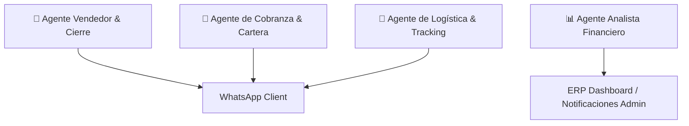

# 📋 Tareas Pendientes y Hoja de Ruta de Escalación Vertical con IA

> [!NOTE]
> Documento creado como hoja de ruta para la sesión de trabajo. Define los puntos de auditoría del proyecto y las oportunidades de **Escalación Vertical con IA**.

---

## 📌 1. Puntos de Auditoría General del Proyecto

Para la revisión completa del proyecto, se evaluarán los siguientes módulos core:

- [x] **Módulo de Facturación y Cobro (`SaaSErpInvoices.tsx`):**
  - Auditoría de emisión de recibos, métodos de pago y flujo de comprobantes vía WhatsApp.
  - **Almacenamiento Escalable Multi-Tenant:** Ruta de fotos por cliente y fecha (`/uploads/tenants/<clientId>/receipts/YYYY/MM/`) + copia en la nube Google Drive (`driveFolderId`).
- [ ] **Módulo Contable y Financiero (`SaaSErpAccounting.tsx`):**
  - Revisión del gráfico de tendencia diaria, KPIs de ventas, métodos de pago y exportación de reportes.
- [ ] **Módulo de Inventario y Rotación (`SaaSErpInventory.tsx`):**
  - Verificación de la tasa de rotación, stock mínimo y alertas de agotamiento.
- [ ] **CRM y Clientes (`SaaSErpCustomers.tsx`):**
  - Historial de compras por cliente, historial óptico (fórmula de lentes) y segmentación.
- [ ] **Módulo de Logística y Entregas (`deliveries`):**
  - Seguimiento de estados de despacho (*tienda vs domicilio*) y asignación de motorizados/mensajeros.
- [ ] **Sistema de Trazabilidad Global y Bitácora de Auditoría (`system_audit_logs`):**
  - Registro de confirmación de hechos, inicios de sesión, cambios de stock/precios, aprobación de pagos y actividad por empleado.

---

## 🚀 2. Oportunidades de Escalación Vertical con IA

La **escalación vertical con IA** busca potenciar cada módulo ERP con agentes autónomos especializados que ejecuten tareas sin intervención humana:

### 🤖 A. Agente Vendedor y Cotizador Inteligente (Atención 24/7)
- **Función:** Asesoría activa por WhatsApp, cotizaciones automáticas de fórmulas ópticas, recomendación de lentes (*fotocromáticos, antirreflejo, progresivos*) y agendamiento de citas de optometría.
- **Acción Autónoma:** Registro automático del cliente en el CRM y borrador de factura en el ERP.

### 💳 B. Agente de Cobranza y Recuperación de Cartera
- **Función:** Seguimiento inteligente de facturas pendientes y créditos por cuotas con vencimiento próximo o en mora.
- **Acción Autónoma:** Envío de recordatorios amigables con enlace de pago o datos bancarios y recolección automática de comprobantes.

### 🚚 C. Agente de Logística y Rastreo de Envíos
- **Función:** Notificaciones proactivas de estado de despacho por WhatsApp (*"Tu pedido ha sido despachado y va en camino con el repartidor 🏍️"*).
- **Acción Autónoma:** Recepción de confirmaciones de entrega y feedback del cliente.

### 📊 D. Agente Analista Financiero (Executive Summary para el Dueño)
- **Función:** Agente en segundo plano que compila métricas diarias/semanales del negocio.
- **Acción Autónoma:** Envío de un resumen ejecutivo por mensaje de texto o nota de voz en WhatsApp al teléfono personal del dueño (*"Hoy vendiste $1.200.000 COP, el producto más vendido fue..."*).

---

## 📅 Checklist para Mañana

- [ ] Revisión integral de código y flujos activos.
- [ ] Selección y priorización de las funciones de escalación vertical con IA.
- [ ] Pruebas de integración con WhatsApp y Gemini API.
