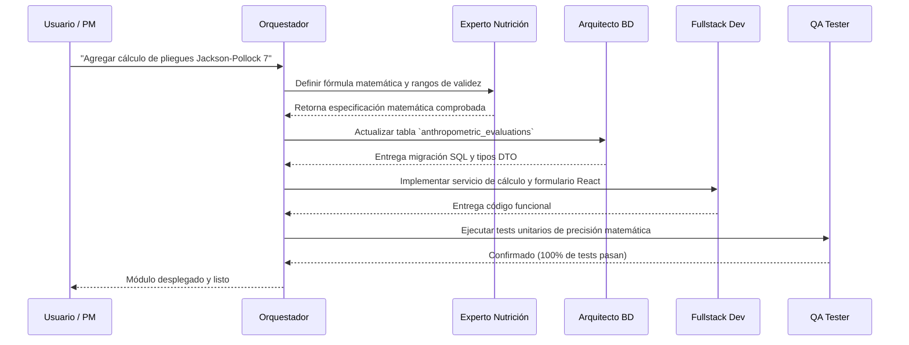

# Flujos de Trabajo Inter-Agentes

## Flujo 1: Implementación de Nuevo Módulo de Cálculo Nutricional

## Flujo 2: Corrección de Bug o Excepción en Runtime
1. **Monitor de Errores** extrae la traza limpia del error y la causa raíz.
2. **Orquestador** redirige al **Fullstack Dev** con la línea exacta y la regla de no parche superficial.
3. **Fullstack Dev** aplica la corrección.
4. **QA Tester** re-ejecuta la prueba de regresión.
