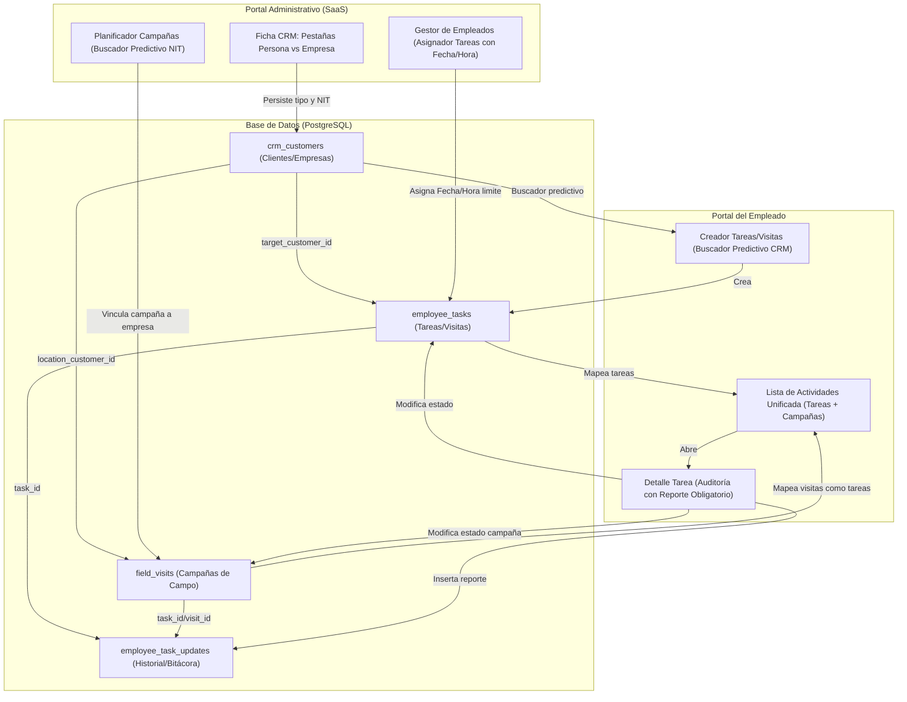
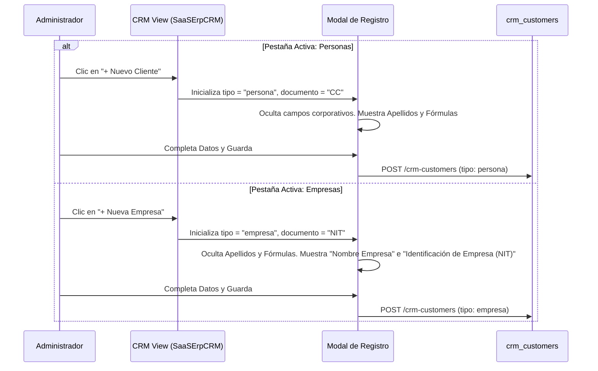
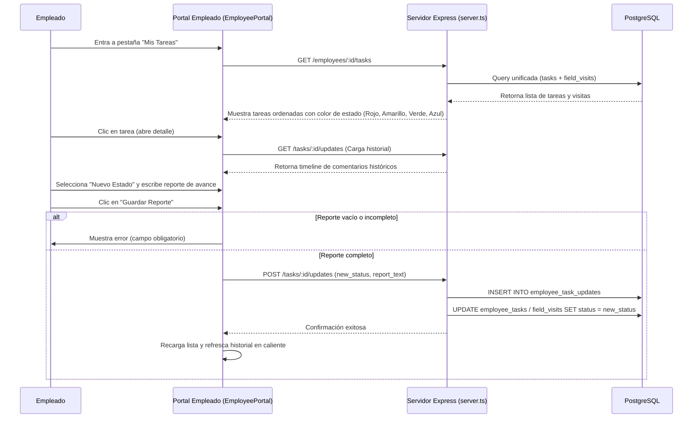
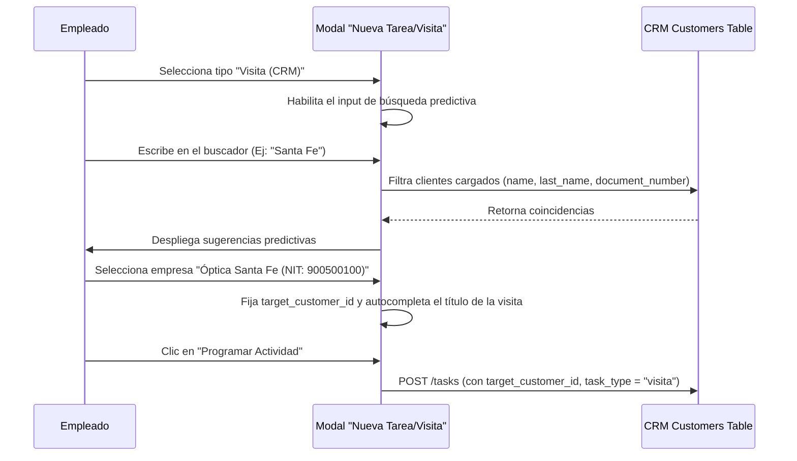

# Arquitectura de Tareas y CRM - Documentación del Sistema

Esta documentación detalla las propiedades añadidas, la estructura de la base de datos y la dinámica de interacción entre el módulo administrativo y el portal del empleado.

---

## 1. Esquema de Propiedades y Base de Datos

Se han modificado y creado tablas en PostgreSQL para segmentar el CRM y gestionar las tareas con control de estado y auditoría obligatoria.

### Tabla: `crm_customers`
Almacena la información de contacto y prescripciones de personas y empresas.

| Propiedad | Tipo | Descripción |
| :--- | :--- | :--- |
| `customer_type` | `VARCHAR(20)` | `persona` (por defecto) o `empresa`. |
| `name` | `VARCHAR(255)` | Nombre del cliente o Nombre comercial de la empresa. |
| `last_name` | `VARCHAR(255)` | Apellidos (nulo para empresas). |
| `document_type` | `VARCHAR(20)` | `CC`, `CE` (para personas) o `NIT` (para empresas). |
| `document_number`| `VARCHAR(50)` | Número único de identificación fiscal o de ciudadanía. |

### Tabla: `employee_tasks`
Gestiona el listado de actividades y visitas asignadas o creadas por el trabajador.

| Propiedad | Tipo | Descripción |
| :--- | :--- | :--- |
| `task_type` | `VARCHAR(20)` | `tarea` (común, por defecto) o `visita` (CRM). |
| `target_customer_id` | `UUID` | Llave foránea a `crm_customers.id` (para asociar visitas). |
| `due_date` | `TIMESTAMP` | Fecha y hora límite consolidadas en formato ISO. |
| `status` | `VARCHAR(50)` | Estado de avance: `pendiente`, `en proceso` o `terminado`. |

### Tabla: `employee_task_updates` (Nueva)
Bitácora de auditoría. Cada cambio de estado de una tarea o campaña requiere registrar una fila en esta tabla.

| Propiedad | Tipo | Descripción |
| :--- | :--- | :--- |
| `id` | `UUID (PK)` | Identificador autogenerado de la actualización. |
| `task_id` | `UUID` | ID de la tarea (`employee_tasks`) o campaña (`field_visits`). |
| `old_status` | `VARCHAR(50)` | Estado anterior de la tarea antes del cambio. |
| `new_status` | `VARCHAR(50)` | Nuevo estado seleccionado por el trabajador. |
| `report_text` | `TEXT` | Texto obligatorio del reporte de avances ingresado. |
| `created_by_name`| `VARCHAR(255)` | Nombre de quien realizó la actualización. |
| `created_at` | `TIMESTAMP` | Timestamp del registro. |

---

## 2. Esquema General de Interacciones (Mermaid)

Este diagrama representa cómo se conectan el CRM, el Programador de Tareas, el Historial de Avances y el Portal de Empleado de manera unificada.

---

## 3. Flujo Detallado por Secciones

### A. Sección CRM y Registro de Clientes

Este flujo muestra cómo el formulario en el panel administrativo adapta los campos según la pestaña activa del CRM para evitar registros inconsistentes.

---

### B. Módulo de Empleados: Ciclo de Vida de una Tarea y Auditoría

Flujo de interacción cuando un empleado visualiza una tarea asignada, cambia su estado, y se le exige ingresar un avance detallado por escrito.

---

### C. Autogestión de Visitas con Buscador Predictivo

Muestra cómo el empleado programa una visita y consulta contactos corporativos y personales del CRM en tiempo real.

